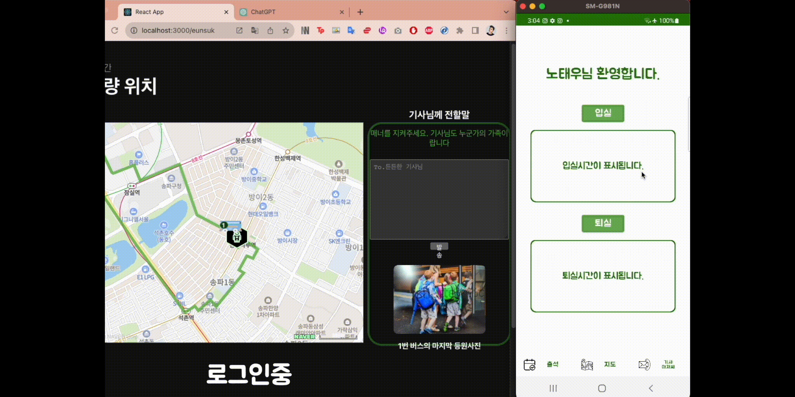
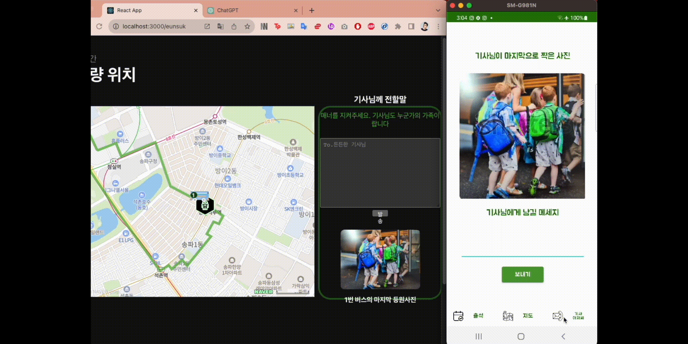

# BitCamp Final Project

##### 비트캠프 마지막 프로젝트 3조
##### 프로젝트 명 : 에듀벤쳐 (Edu-Venture)
##### 앱 이름 : EduVenture-Student
##### 팀원 : 김민제, 강호현, 김한슬, 이완재, 조현진, 김정우, 김은석
##### 프로젝트 기간 : 2020.08.02 ~ 2020.09.11
##### 개발 환경: Android Studio, Java, Retrofit API, SpringBoot, MySQL, NaverCloud

## Edu-Student

+ 앱 내용:  

  + 학생들이 원격으로 입실 퇴실을 자율적으로 할 수 있는 기능 추가
  + 학생이 버스의 위치, 자신의 위치, 버스의 경로 확인 가능
  + 버스기사가 마지막으로 찍은 학생의 승차사진 확인 가능
  + NaverCloud SMS 서비스를 이용해 버스기사의 번호 유출 없이 기사에게 문자 송신 가능
  + 녹화된 강의를 학생이 볼수있도록 불러오는 기능

## 구현 방식

######  0) 전체적인 구조  

+ Retrofit API, OKHttp를 통해 Spring에 접근. 로그인/출석/버스위치 불러오기/기사 연락/기사가 찍은 사진 보기, 강의보기 기능
+ 화면 Fragment로 세가지 구성(출석, 지도, 기사연락, 강의)
+ 서버에 요청하고 Response를 받기위해 여러가지 DTO 생성  

  + UserDTO
  + GPS
  + DriverPhoto
  + CourseDTO
  + AttendDTO
  + ResponseDTO
  + MessageDTO
  + VodBoard

######  1) 로그인 탭  

+ 로그인기능  

  + Spring boot를 통해 mysql에 저장된 user테이블 조회
  + 에러가 나면 responseDTO의 에러메세지를 화면에 Toast로 표시

######  2) 입실  탭  
  
+ 입, 퇴실기능  

  + Spring boot서버에 요청을해  attendance 테이블에 입, 퇴실시간 작성
  + 에러가 나면 responseDTO의 에러메세지를 화면에 Toast로 표시
  + -> 나의수업 요일, 수업시간에만 attendance 테이블에 적히도록 springboot서버에 코딩.
  + 입실, 퇴실을 했을 시 버튼 아래 화면에 입실시간이 나온다.
  + 화면을 불러올때 이미 한 입, 퇴실시간을 불러오지는 않는다.

######  3) 지도  탭  

+ naver지도 표시기능

  + navermap api 기능을 통해 지도에 버스의 경로 표시
  + 안드로이드 내부의 FusedLocationProviderClient 기능을 통해 나의 위치 표시
  + Springboot 서버를 통해 버스기사의 위치를 불러와 지도에 표시

######  3) 기사아저씨  탭  

+ 기사가 마지막으로 찍은 사진 표시

  +  Springboot를 통해 navercloud objectstorage에 저장되어있는 기사가 찍은 마지막 아이들 승차사진을 불러와  표시

+ 기사에게 sms메세지 보내기

  + 서버에서 내가타는 차의 버스기사 번호를 불러와 나의 메세지와 함께 MessageDTO 객체에 넣어서 서버에 전송
  + 서버에서는 NaverCloud sms 서비스를 통해 기사의 번호에 메세지를 전송

######  4) 강의  탭

+ 학생의 강의시청기능

  + Springboot를 통해 navercloud objectstorage에 저장되어있는 강의영상을 표시
  + 학생의 편의를 위해 비디오가 시작하자마자 가로화면으로 전환
  

  

## 예시

 
 

1) 로그인기능  

 
 

 
 

2) 입실퇴실기능  

 
 

 
 

3) 기사아저씨한테 sms보내기  

 
 

 
 

4) 기사아저씨가 찍은 학원생 승차사진 확인  

   
   

 
 

5) 위치조작 확인  

 
 

 
 

6) 강의영상 시청

 
 

 
 

## 구동영상 링크

https://youtu.be/MGV5L8B7XAI?si=Ymq5cbJtdqpsbtJI